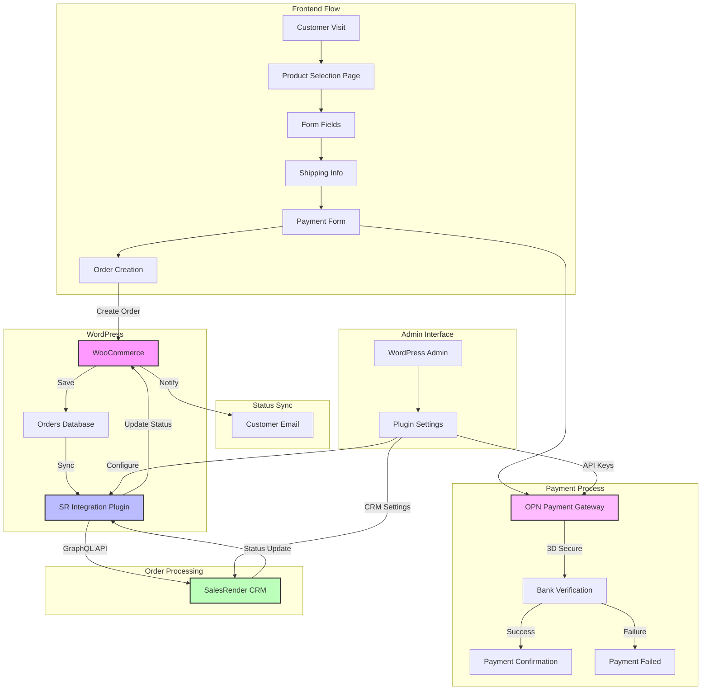

# SalesRender WooCommerce Integration - sr-wc-integration

Integration plugin for WooCommerce with SalesRender CRM and OPN Payment Gateway. This plugin provides a streamlined checkout process with product selection, customer information collection, and secure payment processing.

## Features

- Custom checkout page with responsive design (desktop/mobile)
- Integration with SalesRender CRM via GraphQL API
- OPN Payment Gateway integration with 3D Secure support
- Two-way order status synchronization between WooCommerce and SalesRender
- Multi-variant product selection (1x, 2x, 3x, 4x packages)
- Customizable form fields for customer and shipping information
- Thailand-specific phone number format support

## Schema



## Requirements

- WordPress 5.0 or higher
- WooCommerce 3.3.4 or higher
- PHP 7.4 or higher
- SSL certificate (required for payment processing)
- SalesRender CRM account with API access
- OPN Payment Gateway merchant account

## Installation

1. Download the latest release
2. Upload the plugin files to `/wp-content/plugins/sr-wc-integration`
3. Activate the plugin through the WordPress plugins screen
4. Configure the plugin settings (see Configuration section)

## Configuration

### SalesRender API Setup

1. Go to WordPress Admin → SalesRender Integration → Settings
2. Enter your SalesRender API credentials:
   - Company ID
   - API Token
   - Project ID
3. Configure order status mappings between WooCommerce and SalesRender

### OPN Payment Gateway Setup

1. Go to WooCommerce → Settings → Payments
2. Enable and configure OPN Payment Gateway:
   - Enter Public/Secret keys
   - Configure 3D Secure settings
   - Set up payment methods (Credit Card, PayPal, etc.)

### Checkout Page Setup

1. Create a new page for checkout or use existing WooCommerce checkout
2. Select "SR Checkout Template" from page template options
3. Customize product variants and pricing in plugin settings

## Usage

### Product Configuration

Configure your product variants in WooCommerce:
```php
// Example product configuration
$product_variants = [
    '4x' => [
        'price' => 1892.00,
        'quantity' => 40
    ],
    '3x' => [
        'price' => 1554.00,
        'quantity' => 30
    ],
    // ... other variants
];
```

### Order Status Synchronization

The plugin automatically syncs order statuses between platforms:

- WooCommerce → SalesRender
  - 'pending' → 'new'
  - 'processing' → 'in_progress'
  - 'completed' → 'completed'
  - 'failed' → 'failed'

- SalesRender → WooCommerce
  - Status updates are pushed via webhooks

### Payment Processing

Payment flow:
1. Customer selects product variant
2. Fills personal and shipping information
3. Proceeds to OPN secure payment
4. 3D Secure verification (if required)
5. Order creation in both WooCommerce and SalesRender

## Developer Notes

### Adding Custom Fields

Add custom fields to checkout form:

```php
add_filter('sr_checkout_fields', function($fields) {
    $fields['custom_field'] = [
        'type' => 'text',
        'label' => 'Custom Field',
        'required' => true
    ];
    return $fields;
});
```

### Modifying Order Sync

Customize order data before sync:

```php
add_filter('sr_before_order_sync', function($order_data, $wc_order) {
    // Modify order data
    return $order_data;
}, 10, 2);
```

## Troubleshooting

Common issues and solutions:

1. Payment Gateway Connection Issues
   - Verify API credentials
   - Check SSL certificate
   - Ensure proper 3D Secure configuration

2. Order Sync Problems
   - Check SalesRender API access
   - Verify webhook URLs
   - Check order status mappings

3. Form Validation Errors
   - Validate field requirements
   - Check phone number format
   - Verify address field formatting

## Support

For support requests:
- Check documentation at [Documentation URL]
- Submit issues on GitHub
- Contact support@yourcompany.com

## License

This plugin is licensed under the GPL v2 or later.

## Credits

- WooCommerce team for the e-commerce platform
- OPN team for payment gateway integration
- SalesRender team for CRM integration
